# FIXYA — Arquitectura Completa del Sistema

**Versión:** 1.0.0  
**Fecha:** 13 de junio de 2026  
**Estado:** Aprobación pendiente  
**Depende de:** FASE-01-DOCUMENTO-FUNCIONAL-FIXYA.md v1.0.0  
**Clasificación:** Confidencial — Uso interno  

---

## Control de versiones

| Versión | Fecha | Autor | Descripción |
|---------|-------|-------|-------------|
| 1.0.0 | 2026-06-13 | Equipo FixYa | Arquitectura completa — Fase 2 |

---

## Tabla de contenidos

1. [Resumen arquitectónico](#1-resumen-arquitectónico)
2. [Principios y patrones](#2-principios-y-patrones)
3. [Decisiones arquitectónicas (ADR)](#3-decisiones-arquitectónicas-adr)
4. [C4 Nivel 1 — Contexto](#4-c4-nivel-1--contexto)
5. [C4 Nivel 2 — Contenedores](#5-c4-nivel-2--contenedores)
6. [C4 Nivel 3 — Componentes](#6-c4-nivel-3--componentes)
7. [Arquitectura hexagonal por bounded context](#7-arquitectura-hexagonal-por-bounded-context)
8. [CQRS y Event Sourcing parcial](#8-cqrs-y-event-sourcing-parcial)
9. [Event-Driven Architecture](#9-event-driven-architecture)
10. [Diagramas UML](#10-diagramas-uml)
11. [ERD preliminar](#11-erd-preliminar)
12. [Diagramas de secuencia](#12-diagramas-de-secuencia)
13. [Diagrama de componentes](#13-diagrama-de-componentes)
14. [Multi-tenant y seguridad](#14-multi-tenant-y-seguridad)
15. [Infraestructura AWS](#15-infraestructura-aws)
16. [Despliegue y CI/CD](#16-despliegue-y-cicd)
17. [Observabilidad](#17-observabilidad)
18. [Escalabilidad y resiliencia](#18-escalabilidad-y-resiliencia)
19. [Stack tecnológico detallado](#19-stack-tecnológico-detallado)
20. [Anexos](#20-anexos)

---

## 1. Resumen arquitectónico

FixYa se diseña como una **plataforma SaaS multi-tenant event-driven** con arquitectura **modular monolith evolutivo** en backend (NestJS) preparado para extraer microservicios cuando el dominio lo justifique (Emitia ya nace desacoplado).

### 1.1 Estilo arquitectónico

```
┌─────────────────────────────────────────────────────────────────┐
│                    PRESENTATION LAYER                            │
│         Next.js 15 (SSR/SSG/RSC) + Socket.IO Client             │
└────────────────────────────┬────────────────────────────────────┘
                             │ REST / WebSocket
┌────────────────────────────▼────────────────────────────────────┐
│                    APPLICATION LAYER (NestJS)                      │
│   Controllers → Commands/Queries (CQRS) → Use Cases               │
└────────────────────────────┬────────────────────────────────────┘
                             │
┌────────────────────────────▼────────────────────────────────────┐
│                      DOMAIN LAYER (DDD)                            │
│   Aggregates · Entities · Value Objects · Domain Events          │
└────────────────────────────┬────────────────────────────────────┘
                             │
┌────────────────────────────▼────────────────────────────────────┐
│                   INFRASTRUCTURE LAYER                             │
│   Prisma Repos · Redis · BullMQ · S3 · MP Client · Emitia Client  │
└─────────────────────────────────────────────────────────────────┘
```

### 1.2 Bounded contexts

| Contexto | Responsabilidad | Tipo |
|----------|-----------------|------|
| **Identity** | Auth, tenants, RBAC/ABAC | Core |
| **Marketplace** | Catálogo, solicitudes, cotizaciones | Core |
| **CRM** | Leads, clientes, pipeline | Supporting |
| **Engagement** | Contratación, expediente, ciclo de vida | Core |
| **Projects** | Tareas, hitos, cronogramas | Supporting |
| **Documents** | Versionado, flujos, firmas | Core |
| **Payments** | Mercado Pago, webhooks | Core |
| **Wallet** | Ledger contable, conciliación | Core |
| **Emitia** | Facturación fiscal ARCA | Subsistema |
| **Chat** | Mensajería realtime | Supporting |
| **Compliance** | Validaciones AR, alertas | Core |
| **Notifications** | Email, push, WhatsApp | Generic |
| **AI** | Asistentes por módulo | Supporting |
| **Audit** | Logs inmutables, trazabilidad | Generic |

### 1.3 Comunicación entre contextos

| Tipo | Cuándo | Mecanismo |
|------|--------|-----------|
| Síncrona | Consultas, validaciones inmediatas | REST interno / in-process |
| Asíncrona | Side effects, integraciones | Domain Events → BullMQ |
| Realtime | Chat, notificaciones live | Socket.IO + Redis Adapter |
| Externa | MP, ARCA, Resend | HTTP/Webhooks con retry |

---

## 2. Principios y patrones

### 2.1 Principios SOLID aplicados

| Principio | Aplicación FixYa |
|-----------|------------------|
| **S** — Single Responsibility | Cada handler CQRS una operación; cada aggregate un invariante |
| **O** — Open/Closed | Estrategias de comisión, tipos comprobante Emitia extensibles |
| **L** — Liskov Substitution | Repositorios implementan ports; mocks en tests |
| **I** — Interface Segregation | Ports granulares: `IPaymentGateway`, `IFiscalIssuer` |
| **D** — Dependency Inversion | Domain no depende de Prisma/MP/S3; inyección NestJS |

### 2.2 Patrones implementados

| Patrón | Ubicación |
|--------|-----------|
| **DDD** | Aggregates: Engagement, Payment, Wallet, Invoice, Document |
| **Clean Architecture** | Capas domain/application/infrastructure |
| **Hexagonal** | Ports & Adapters por bounded context |
| **CQRS** | Commands (write) / Queries (read) separados |
| **Repository** | Prisma repositories implementan domain ports |
| **Unit of Work** | Prisma `$transaction` + outbox pattern |
| **Domain Events** | EventEmitter + BullMQ persistence |
| **Outbox Pattern** | Garantía entrega eventos post-commit DB |
| **Saga (orquestada)** | Flujo contratación: pago → wallet → emitia → proyecto |
| **Idempotency Key** | Webhooks MP, emisión fiscal |
| **Circuit Breaker** | Llamadas ARCA, MP en infra |
| **Strangler Fig** | Monolith modular → microservicios futuros |

### 2.3 Reglas de dependencia

```
Domain        →  (nada externo)
Application   →  Domain
Infrastructure → Domain + Application
Presentation  →  Application (via API)
```

Prohibido: Domain importando NestJS, Prisma, axios, etc.

---

## 3. Decisiones arquitectónicas (ADR)

### ADR-001: Modular Monolith vs Microservicios

**Decisión:** Modular monolith NestJS con Emitia como subsistema desacoplado.  
**Motivo:** Equipo inicial, consistencia transaccional engagement-wallet-payments, menor ops overhead.  
**Consecuencia:** Límites estrictos entre módulos; extracción via interfaces.

### ADR-002: Multi-tenant shared schema + RLS

**Decisión:** Una BD PostgreSQL, schema compartido, `tenant_id` + Row Level Security.  
**Motivo:** Costo, simplicidad operativa, 1M usuarios con particionado.  
**Alternativa descartada:** DB por tenant (costo prohibitive a escala).

### ADR-003: CQRS ligero (no full Event Sourcing)

**Decisión:** CQRS con proyecciones read optimizadas; event store solo para audit/wallet.  
**Motivo:** Balance complejidad vs beneficio; wallet requiere inmutabilidad.

### ADR-004: BullMQ sobre SQS para jobs

**Decisión:** BullMQ + Redis para colas internas.  
**Motivo:** Latencia, delayed jobs, rate limiting nativo, DX NestJS.

### ADR-005: Socket.IO con Redis Adapter

**Decisión:** Socket.IO cluster mode con Redis pub/sub.  
**Motivo:** Escala horizontal ECS, rooms por conversación.

### ADR-006: S3 primario + R2 réplica documentos

**Decisión:** S3 sa-east-1 write; R2 Cloudflare read CDN documentos públicos.  
**Motivo:** Costo egress + performance LATAM.

### ADR-007: Emitia como microservicios internos

**Decisión:** 9 servicios Emitia en ECS compartiendo VPC, comunicación gRPC interno.  
**Motivo:** Dominio fiscal aislado, deploy independiente, compliance.

### ADR-008: JWT + Refresh rotation

**Decisión:** Access 15min, refresh 30d con rotation y blacklist Redis.  
**Motivo:** Seguridad OWASP, revocación sesiones.

---

## 4. C4 Nivel 1 — Contexto

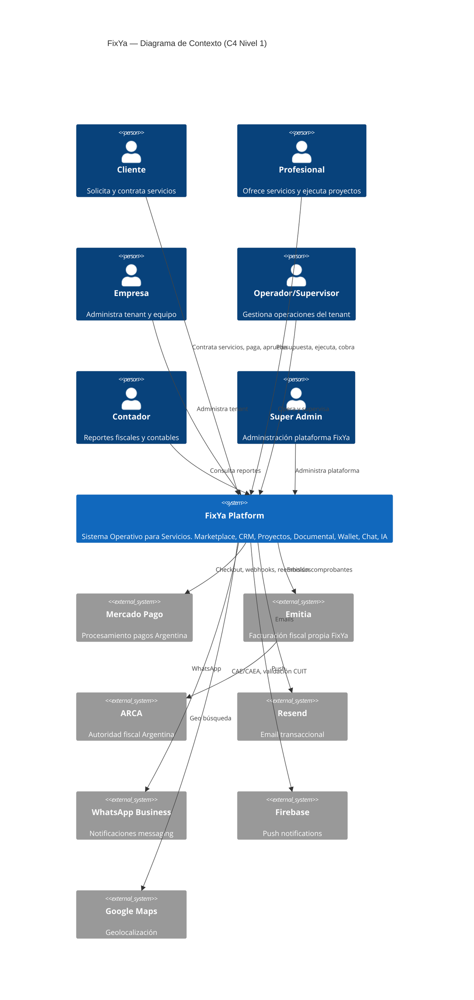

### 4.1 Descripción de actores externos

| Sistema | Protocolo | SLA esperado | Fallback |
|---------|-----------|--------------|----------|
| Mercado Pago | REST + Webhooks | 99.9% | Cola reintentos + polling |
| ARCA (vía Emitia) | SOAP WSFE | ~99% (contingencias) | CAEA pre-cargado |
| Resend | REST | 99.9% | Cola retry 72h |
| WhatsApp | REST | 99.5% | Fallback email |
| Firebase | SDK/REST | 99.9% | Solo in-app |

---

## 5. C4 Nivel 2 — Contenedores

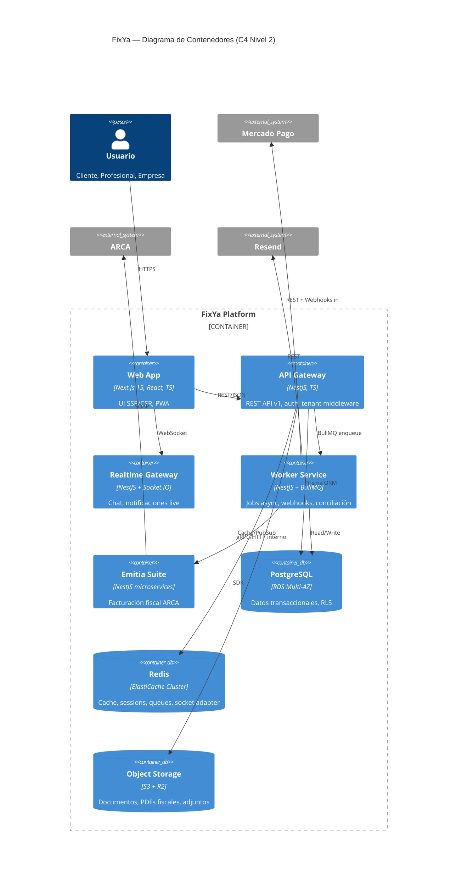

### 5.1 Contenedores y responsabilidades

| Contenedor | Runtime | Réplicas prod | Puerto |
|------------|---------|---------------|--------|
| `fixya-web` | Next.js 15 | 3-10 (auto-scale) | 3000 |
| `fixya-api` | NestJS | 5-20 | 4000 |
| `fixya-ws` | NestJS + Socket.IO | 3-10 | 4001 |
| `fixya-worker` | NestJS + BullMQ | 3-15 | — |
| `emitia-*` (9 svc) | NestJS | 2-5 c/u | 5000-5008 |
| PostgreSQL RDS | — | Multi-AZ primary + 2 read replicas | 5432 |
| Redis ElastiCache | — | Cluster 3 shards | 6379 |
| S3 + CloudFront | — | — | — |

### 5.2 Separación API vs Worker

**API (sync):** Requests HTTP, validación, commands que retornan inmediato, queries.  
**Worker (async):** Webhooks MP, emisión Emitia, emails, conciliación, jobs compliance, IA batch.

---

## 6. C4 Nivel 3 — Componentes

### 6.1 fixya-api — Componentes principales

```mermaid
C4Component
    title fixya-api — Componentes (C4 Nivel 3)

    Container_Boundary(api, "fixya-api") {
        Component(auth, "Auth Module", "JWT, MFA, sessions")
        Component(tenant, "Tenant Module", "Context, middleware, RLS")
        Component(marketplace, "Marketplace Module", "Catálogo, solicitudes, cotizaciones")
        Component(engagement, "Engagement Module", "Contratación, expediente, estados")
        Component(crm, "CRM Module", "Leads, pipeline, clientes")
        Component(projects, "Projects Module", "Tareas, hitos")
        Component(documents, "Documents Module", "Versionado, firmas, flujos")
        Component(payments, "Payments Module", "MP integration, webhooks handler")
        Component(wallet, "Wallet Module", "Ledger, movimientos, conciliación")
        Component(compliance, "Compliance Module", "CUIT, matrículas, alertas")
        Component(chat, "Chat Module", "Conversaciones, mensajes")
        Component(notifications, "Notifications Module", "Orquestador multicanal")
        Component(ai, "AI Module", "Asistentes, clasificación")
        Component(audit, "Audit Module", "Audit log, export")
        Component(cqrs, "CQRS Bus", "CommandBus, QueryBus, EventBus")
    }

    Rel(marketplace, engagement, "QuotationAccepted event")
    Rel(engagement, payments, "InitiatePayment command")
    Rel(payments, wallet, "PaymentConfirmed event")
    Rel(wallet, emitia, "IssueInvoice command")
    Rel(engagement, projects, "CreateProject command")
    Rel(compliance, marketplace, "Block if expired")
```

### 6.2 Emitia Suite — Componentes

```mermaid
C4Component
    title Emitia Suite — Componentes

    Container_Boundary(emitia, "Emitia") {
        Component(eapi, "emitia-api", "API Gateway interno")
        Component(eauth, "emitia-auth", "Auth servicios Emitia")
        Component(einv, "emitia-invoicing", "Facturas A/B/C/E")
        Component(enc, "emitia-credit-notes", "Notas crédito")
        Component(end, "emitia-debit-notes", "Notas débito")
        Component(epdf, "emitia-pdf-engine", "PDF + QR AFIP")
        Component(earca, "emitia-arca", "WS ARCA CAE/CAEA")
        Component(ereport, "emitia-reporting", "Reportes fiscales")
        Component(eaudit, "emitia-audit", "Auditoría emisiones")
    }

    Rel(eapi, einv, "gRPC")
    Rel(einv, earca, "Solicitar CAE")
    Rel(einv, epdf, "Generar PDF")
    Rel(earca, arca_ext, "SOAP WSFE")
```

---

## 7. Arquitectura hexagonal por bounded context

### 7.1 Estructura de módulo NestJS (template)

```
src/modules/{context}/
├── domain/
│   ├── aggregates/
│   ├── entities/
│   ├── value-objects/
│   ├── events/
│   ├── repositories/        # ports (interfaces)
│   └── services/            # domain services
├── application/
│   ├── commands/
│   │   ├── handlers/
│   │   └── *.command.ts
│   ├── queries/
│   │   ├── handlers/
│   │   └── *.query.ts
│   └── sagas/
├── infrastructure/
│   ├── persistence/
│   │   ├── prisma/
│   │   └── mappers/
│   ├── adapters/            # MP, Emitia, S3
│   └── controllers/
└── {context}.module.ts
```

### 7.2 Engagement — Ports & Adapters

```
                    ┌─────────────────────────────────┐
                    │     ENGAGEMENT DOMAIN           │
                    │  Aggregate: Engagement          │
                    │  VO: EngagementStatus, Money    │
                    │  Events: EngagementCreated,     │
                    │    StatusChanged, Closed         │
                    └──────────────┬──────────────────┘
                                   │ ports
          ┌────────────────────────┼────────────────────────┐
          │                        │                        │
   IEngagementRepository    IPaymentGateway          IDocumentGenerator
          │                        │                        │
   PrismaEngagementRepo     MercadoPagoAdapter       TemplateEngineAdapter
```

### 7.3 Wallet — Ports & Adapters

| Port | Adapter | Descripción |
|------|---------|-------------|
| `ILedgerRepository` | `PrismaLedgerRepository` | Persistencia asientos |
| `IWalletQueryService` | `PrismaWalletQueryService` | Read model balances |
| `IReconciliationService` | `ReconciliationService` | MP vs wallet vs Emitia |
| `IFiscalReference` | `EmitiaClientAdapter` | Ref facturas |

---

## 8. CQRS y Event Sourcing parcial

### 8.1 Modelo CQRS

```
┌──────────────┐     Command      ┌──────────────┐
│   Client     │ ───────────────▶ │ CommandHandler│
│  (Web/API)   │                  └──────┬───────┘
└──────────────┘                         │
                                         ▼
                                  ┌──────────────┐
                                  │  Aggregate   │
                                  │  (Write)     │
                                  └──────┬───────┘
                                         │ persist
                                         ▼
                                  ┌──────────────┐
                                  │ PostgreSQL   │
                                  │ (Write DB)   │
                                  └──────┬───────┘
                                         │ Domain Event
                                         ▼
                                  ┌──────────────┐
                                  │ Outbox Table │
                                  └──────┬───────┘
                                         │ BullMQ
                                         ▼
                                  ┌──────────────┐
                                  │ Projections  │
                                  │ (Read Model) │
                                  └──────────────┘

┌──────────────┐     Query        ┌──────────────┐
│   Client     │ ───────────────▶ │ QueryHandler │
└──────────────┘                  └──────┬───────┘
                                         ▼
                                  ┌──────────────┐
                                  │ Read Model   │
                                  │ (optimized)  │
                                  └──────────────┘
```

### 8.2 Commands principales

| Command | Handler | Aggregate |
|---------|---------|-----------|
| `CreateServiceRequestCommand` | MarketplaceHandler | ServiceRequest |
| `SubmitQuotationCommand` | MarketplaceHandler | Quotation |
| `AcceptQuotationCommand` | EngagementHandler | Engagement |
| `SignContractCommand` | DocumentsHandler | Contract |
| `InitiatePaymentCommand` | PaymentsHandler | Payment |
| `ConfirmPaymentCommand` | PaymentsHandler | Payment |
| `HoldFundsCommand` | WalletHandler | WalletAccount |
| `ReleaseFundsCommand` | WalletHandler | WalletAccount |
| `IssueInvoiceCommand` | EmitiaHandler | Invoice |
| `ApproveProjectCommand` | ProjectsHandler | Project |
| `OpenDisputeCommand` | EngagementHandler | Dispute |

### 8.3 Queries principales (read models)

| Query | Fuente | Optimización |
|-------|--------|--------------|
| `SearchServicesQuery` | `service_search_index` | Full-text + geo PostGIS |
| `GetEngagementTimelineQuery` | `engagement_timeline_view` | Materialized view |
| `GetWalletBalanceQuery` | `wallet_balance_snapshot` | Redis cache 30s |
| `GetPipelineQuery` | `crm_pipeline_view` | Tenant-scoped index |
| `GetComplianceScoreQuery` | `compliance_score_cache` | Redis + daily refresh |

### 8.4 Event Sourcing parcial

Solo **Wallet** y **Audit** usan append-only event log:

```sql
-- wallet_events (append-only)
id, tenant_id, aggregate_id, event_type, payload, sequence, created_at
```

Reconstrucción de balance: replay events desde sequence 0.

---

## 9. Event-Driven Architecture

### 9.1 Catálogo de eventos de dominio

| Evento | Productor | Consumidores | Prioridad cola |
|--------|-----------|--------------|----------------|
| `ServiceRequestPublished` | Marketplace | CRM, Notifications, Search | normal |
| `QuotationSubmitted` | Marketplace | Notifications | high |
| `QuotationAccepted` | Marketplace | Engagement, Documents | critical |
| `ContractGenerated` | Documents | Notifications | high |
| `ContractSigned` | Documents | Payments | critical |
| `PaymentInitiated` | Payments | Notifications | normal |
| `PaymentConfirmed` | Payments | Wallet, Emitia, Projects, Notifications | critical |
| `FundsHeld` | Wallet | Notifications, Audit | critical |
| `InvoiceIssued` | Emitia | Documents, Wallet, Notifications | critical |
| `ProjectCreated` | Projects | Notifications | normal |
| `ProjectCompleted` | Projects | Notifications | high |
| `ProjectApproved` | Projects | Wallet | critical |
| `FundsReleased` | Wallet | Notifications, Payments | critical |
| `DisputeOpened` | Engagement | Wallet, Notifications, Chat | critical |
| `ComplianceExpiring` | Compliance | Notifications, Marketplace | high |
| `ComplianceExpired` | Compliance | Marketplace (block) | critical |

### 9.2 Outbox Pattern

```sql
CREATE TABLE outbox_events (
  id            UUID PRIMARY KEY,
  tenant_id     UUID NOT NULL,
  aggregate_type VARCHAR(50),
  aggregate_id   UUID,
  event_type    VARCHAR(100) NOT NULL,
  payload       JSONB NOT NULL,
  status        VARCHAR(20) DEFAULT 'PENDING',
  created_at    TIMESTAMPTZ DEFAULT NOW(),
  processed_at  TIMESTAMPTZ
);
```

Worker polling cada 1s → publica a BullMQ → marca PROCESSED. Garantía at-least-once; consumidores idempotentes.

### 9.3 Saga: Contratación completa

```
AcceptQuotation
    → GenerateContract (Documents)
    → [wait ContractSigned]
    → InitiatePayment (Payments)
    → [wait PaymentConfirmed via webhook]
    → HoldFunds (Wallet) + IssueInvoice (Emitia) + CreateProject (Projects)  [parallel]
    → [wait ProjectApproved]
    → ReleaseFunds (Wallet)
    → StartWarranty (Engagement)
    → [wait warranty period]
    → CloseEngagement
```

Compensaciones:
- PaymentRejected → CancelEngagement
- InvoiceFailed → Retry 3x → alert CONTADOR → manual
- DisputeOpened → FreezeFunds (no Release)

---

## 10. Diagramas UML

### 10.1 Diagrama de clases — Dominio Engagement (simplificado)

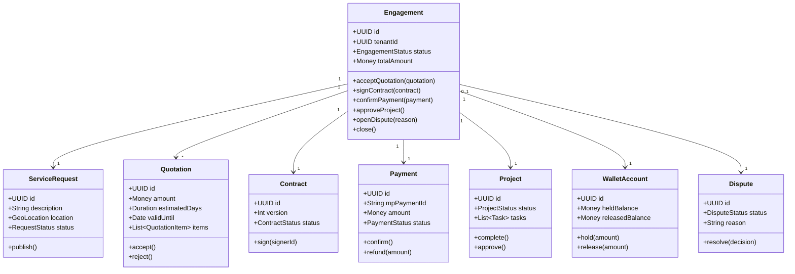

### 10.2 Diagrama de estados — Engagement

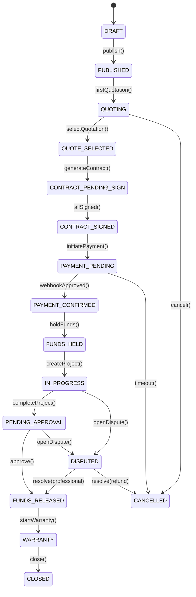

### 10.3 Diagrama de actividades — Liberación de fondos

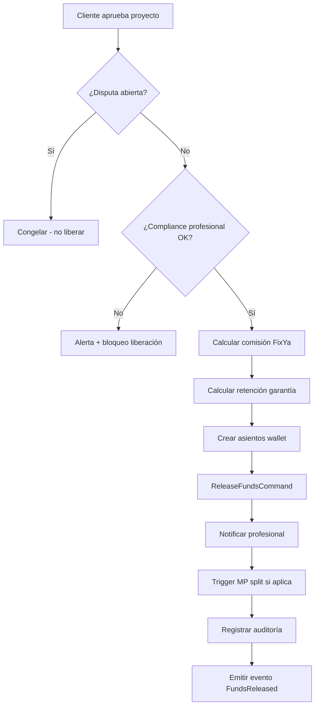

### 10.4 Diagrama de componentes — Frontend

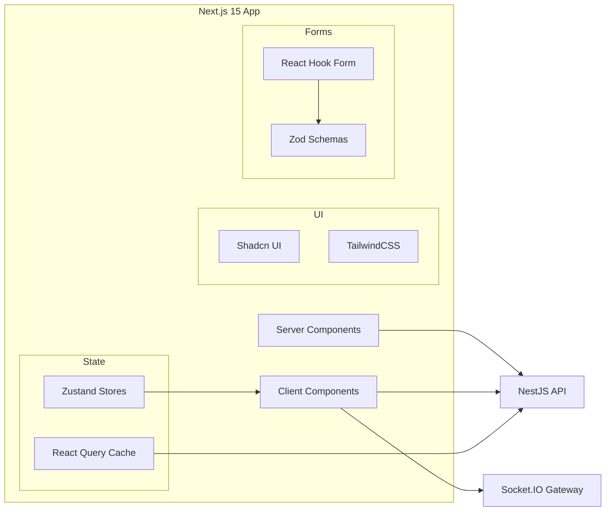

---

## 11. ERD preliminar

### 11.1 Diagrama entidad-relación (core)

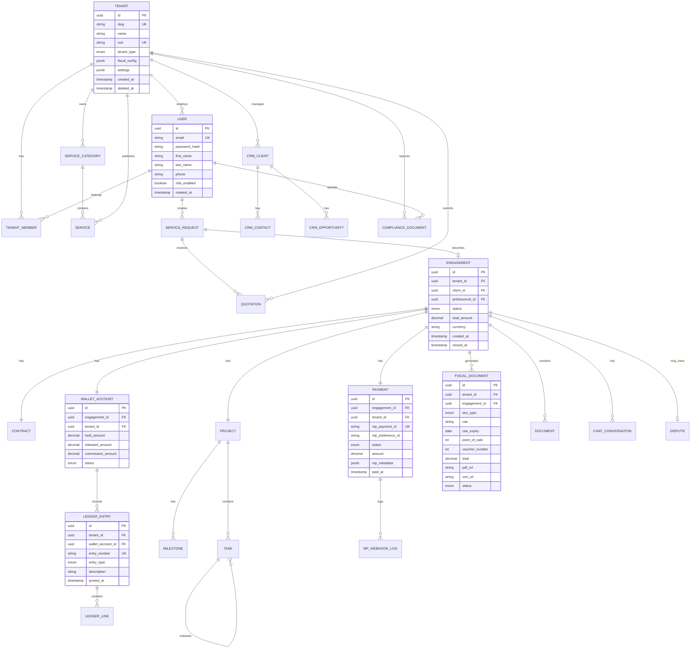

### 11.2 Estrategia de índices clave

| Tabla | Índice | Propósito |
|-------|--------|-----------|
| `engagement` | `(tenant_id, status, created_at DESC)` | Listados dashboard |
| `engagement` | `(client_id, status)` | Historial cliente |
| `service_request` | `(tenant_id, status)` + GIN geo | Marketplace geo |
| `payment` | `(mp_payment_id)` UNIQUE | Idempotencia webhook |
| `ledger_entry` | `(tenant_id, posted_at)` | Libro diario |
| `fiscal_document` | `(tenant_id, cae)` | Conciliación Emitia |
| `outbox_events` | `(status, created_at)` WHERE pending | Outbox polling |
| `audit_log` | `(tenant_id, entity_type, entity_id, created_at)` | Auditoría |

### 11.3 Particionado

| Tabla | Estrategia | Cuándo |
|-------|------------|--------|
| `audit_log` | RANGE por `created_at` mensual | > 50M rows |
| `ledger_entry` | RANGE por `posted_at` mensual | > 50M rows |
| `chat_message` | HASH por `tenant_id` | > 100M rows |
| `mp_webhook_log` | RANGE por `created_at` semanal | > 10M rows |

### 11.4 Row Level Security (RLS)

```sql
ALTER TABLE engagement ENABLE ROW LEVEL SECURITY;

CREATE POLICY tenant_isolation ON engagement
  USING (tenant_id = current_setting('app.current_tenant_id')::uuid);
```

Middleware NestJS ejecuta `SET app.current_tenant_id = '{uuid}'` por request.

---

## 12. Diagramas de secuencia

### 12.1 Secuencia — Pago Mercado Pago (Checkout Pro)

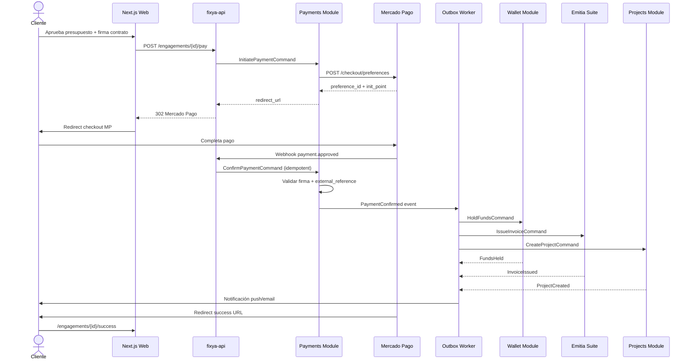

### 12.2 Secuencia — Emisión fiscal Emitia

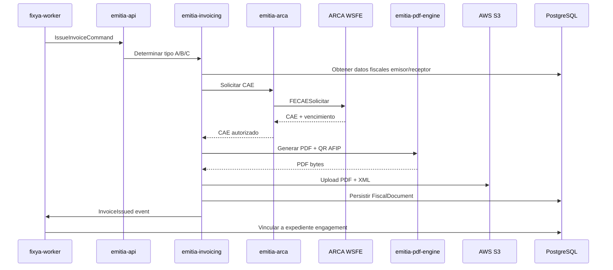

### 12.3 Secuencia — Liberación de fondos

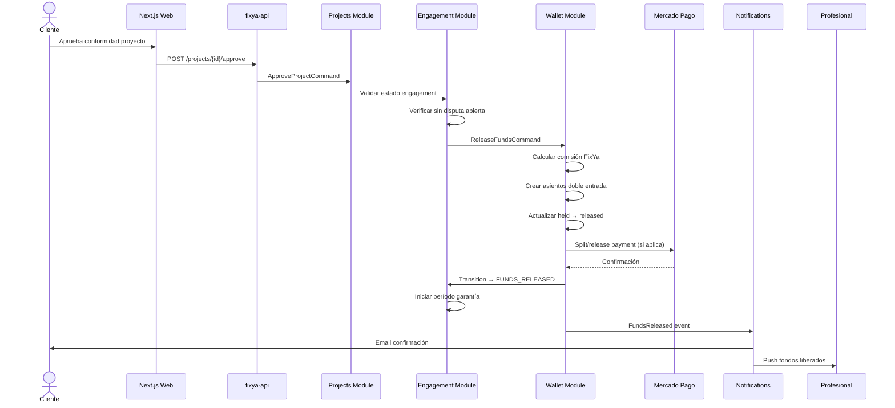

### 12.4 Secuencia — Webhook MP con idempotencia

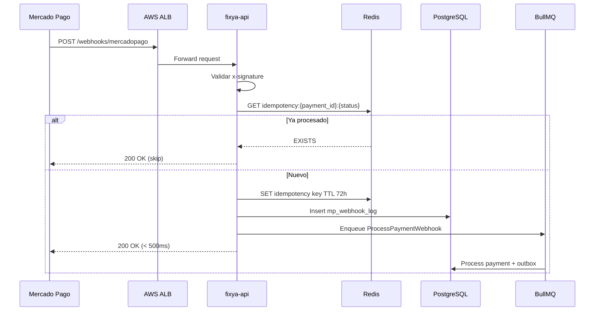

---

## 13. Diagrama de componentes

### 13.1 Vista lógica completa

```
┌─────────────────────────────────────────────────────────────────────────┐
│                           CDN CloudFront                                 │
│                    (static assets + document CDN)                        │
└───────────────────────────────┬─────────────────────────────────────────┘
                                │
┌───────────────────────────────▼─────────────────────────────────────────┐
│                         ALB (HTTPS TLS 1.3)                              │
│              /api/* → fixya-api    /ws/* → fixya-ws    /* → fixya-web   │
└───────┬───────────────────────────────┬─────────────────────────────────┘
        │                               │
┌───────▼────────┐              ┌───────▼────────┐
│   fixya-api    │              │   fixya-ws     │
│   (NestJS)     │              │  (Socket.IO)   │
│                │              │                │
│ ┌────────────┐ │              │ Chat Gateway   │
│ │ CQRS Bus   │ │              │ Redis Adapter  │
│ ├────────────┤ │              └───────┬────────┘
│ │ Modules:   │ │                      │
│ │ Identity   │ │                      │
│ │ Marketplace│ │                      │
│ │ Engagement │◀┼──────────────────────┘
│ │ CRM        │ │
│ │ Projects   │ │
│ │ Documents  │ │
│ │ Payments   │ │
│ │ Wallet     │ │
│ │ Compliance │ │
│ │ Chat       │ │
│ │ Notif.     │ │
│ │ AI         │ │
│ │ Audit      │ │
│ └────────────┘ │
└───────┬────────┘
        │ enqueue
┌───────▼────────┐     gRPC/HTTP      ┌─────────────────┐
│ fixya-worker   │ ─────────────────▶ │  Emitia Suite   │
│                │                    │  (9 services)   │
│ Webhook proc.  │                    └────────┬────────┘
│ Outbox relay   │                             │ SOAP
│ Conciliación   │                    ┌────────▼────────┐
│ Compliance jobs│                    │     ARCA        │
│ Email/WhatsApp │                    └─────────────────┘
│ IA batch       │
└───────┬────────┘
        │
┌───────▼────────────────────────────────────────┐
│  PostgreSQL RDS    │  Redis ElastiCache  │  S3  │
│  (Multi-AZ + RR)   │  (Cluster)          │  R2  │
└────────────────────────────────────────────────┘
```

### 13.2 Comunicación inter-servicio

| Origen | Destino | Protocolo | Auth |
|--------|---------|-----------|------|
| Web → API | REST | JWT Bearer |
| Web → WS | WebSocket | JWT query param |
| API → Worker | BullMQ | Redis internal |
| Worker → Emitia | gRPC | mTLS interno VPC |
| API → S3 | AWS SDK | IAM Role |
| Worker → MP | HTTPS REST | OAuth token tenant |
| Emitia → ARCA | SOAP | Certificado AFIP |

---

## 14. Multi-tenant y seguridad

### 14.1 Flujo de tenant context

```
Request → JWT decode → user_id
       → TenantMiddleware: resolve active_tenant_id (header X-Tenant-ID o default)
       → SET app.current_tenant_id (PostgreSQL session)
       → ABAC guard: evaluate policies
       → Controller → Command/Query (tenant_id injected)
       → Repository: always filter tenant_id
       → Response
```

### 14.2 Modelo de seguridad

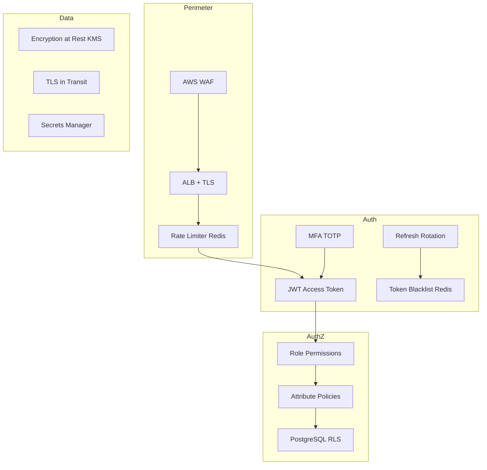

### 14.3 Matriz OWASP Top 10 — Mitigaciones

| Riesgo | Mitigación FixYa |
|--------|------------------|
| A01 Broken Access Control | RBAC + ABAC + RLS + tenant middleware |
| A02 Cryptographic Failures | TLS 1.3, bcrypt/argon2, KMS, no PAN storage |
| A03 Injection | Prisma ORM, Zod validation, CSP |
| A04 Insecure Design | Threat modeling, saga compensations |
| A05 Security Misconfiguration | IaC, hardened AMIs, Secrets Manager |
| A06 Vulnerable Components | Dependabot, Snyk CI |
| A07 Auth Failures | MFA, refresh rotation, lockout |
| A08 Integrity Failures | Webhook signatures MP, signed URLs S3 |
| A09 Logging Failures | Centralized audit, immutable wallet log |
| A10 SSRF | Allowlist outbound, no user-controlled URLs |

### 14.4 Rate limiting

| Scope | Límite | Ventana |
|-------|--------|---------|
| Login | 5 intentos | 15 min |
| API usuario autenticado | 100 req | 1 min |
| API tenant | 1.000 req | 1 min |
| Webhook MP | 10.000 req | 1 min |
| Búsqueda marketplace | 30 req | 1 min |
| Upload documentos | 20 req | 1 min |

---

## 15. Infraestructura AWS

### 15.1 Diagrama de infraestructura

```
                         ┌─────────────────┐
                         │   Route 53 DNS   │
                         └────────┬────────┘
                                  │
                         ┌────────▼────────┐
                         │   CloudFront     │
                         │   (CDN + WAF)    │
                         └────────┬────────┘
                                  │
              ┌───────────────────▼───────────────────┐
              │              VPC 10.0.0.0/16           │
              │  ┌─────────────────────────────────┐  │
              │  │     Public Subnets (3 AZ)        │  │
              │  │  ALB │ NAT Gateway │ Bastion    │  │
              │  └──────────────┬──────────────────┘  │
              │  ┌──────────────▼──────────────────┐  │
              │  │     Private Subnets (3 AZ)       │  │
              │  │                                  │  │
              │  │  ┌──────── ECS Fargate Cluster ────────┐
              │  │  │ fixya-web │ fixya-api │ fixya-ws  │
              │  │  │ fixya-worker │ emitia-*           │
              │  │  └──────────────────────────────────┘
              │  │                                  │  │
              │  │  RDS PostgreSQL    ElastiCache   │  │
              │  │  (Multi-AZ)        Redis Cluster │  │
              │  └──────────────────────────────────┘  │
              └──────────────────────────────────────────┘
                         │                    │
              ┌──────────▼────────┐  ┌───────▼────────┐
              │   S3 Buckets      │  │ Secrets Manager │
              │   (docs, backups) │  │ Parameter Store │
              └───────────────────┘  └─────────────────┘
                         │
              ┌──────────▼────────┐
              │   CloudWatch       │
              │   → Prometheus     │
              │   → Grafana        │
              └───────────────────┘
```

### 15.2 Recursos AWS por ambiente

| Recurso | DEV | STAGING | PRODUCCIÓN |
|---------|-----|---------|------------|
| ECS fixya-api | 1 task | 2 tasks | 5-20 auto-scale |
| ECS fixya-worker | 1 task | 2 tasks | 3-15 auto-scale |
| ECS fixya-web | 1 task | 2 tasks | 3-10 auto-scale |
| RDS PostgreSQL | db.t3.medium | db.r6g.large | db.r6g.2xlarge Multi-AZ |
| Read Replicas | 0 | 1 | 2 |
| Redis | cache.t3.micro | cache.r6g.large | cache.r6g.xlarge cluster |
| S3 | 1 bucket | 1 bucket | 3 buckets (docs, backup, logs) |
| ALB | 1 | 1 | 1 + WAF |
| CloudFront | — | 1 | 1 |

### 15.3 Red y seguridad VPC

| Subnet | CIDR | Contenido |
|--------|------|-----------|
| Public AZ-a | 10.0.1.0/24 | ALB, NAT |
| Public AZ-b | 10.0.2.0/24 | ALB, NAT |
| Public AZ-c | 10.0.3.0/24 | ALB, NAT |
| Private AZ-a | 10.0.10.0/24 | ECS, RDS, Redis |
| Private AZ-b | 10.0.11.0/24 | ECS, RDS, Redis |
| Private AZ-c | 10.0.12.0/24 | ECS, RDS, Redis |

Security Groups:
- ALB: 443 inbound from 0.0.0.0/0
- ECS: inbound from ALB SG only
- RDS: 5432 from ECS SG only
- Redis: 6379 from ECS SG only

### 15.4 Backup y Disaster Recovery

| Componente | Frecuencia | Retención | RTO | RPO |
|------------|------------|-----------|-----|-----|
| RDS automated | Continuo + daily snapshot | 35 días | 1h | 15min |
| S3 documents | Cross-region replication | 10 años | 4h | 1h |
| Redis | Daily RDB snapshot | 7 días | 30min | 1h |
| Secrets | Automatic rotation | — | — | — |

**DR Strategy:** Warm standby en us-east-1 (failover manual → automático fase 15).

---

## 16. Despliegue y CI/CD

### 16.1 Ambientes

```
DEV (local + cloud)  →  STAGING  →  PRODUCCIÓN
     │                      │              │
  Docker Compose       ECS staging     ECS prod
  Hot reload           Parity prod     Blue-Green
```

### 16.2 Pipeline GitHub Actions

```yaml
# .github/workflows/deploy.yml (conceptual)
on:
  push:
    branches: [main, staging, develop]

jobs:
  lint-test:
    - npm run lint
    - npm run test:unit (coverage ≥ 95%)
    - npm run test:integration
  
  build:
    - docker build → ECR
    - trivy scan (security)
  
  deploy-staging:
    - ecs deploy (blue-green)
    - npm run test:e2e:staging
  
  deploy-prod:
    - manual approval
    - ecs deploy (blue-green)
    - smoke tests
    - auto-rollback on failure
```

### 16.3 Blue-Green Deployment

```
ALB Target Group A (blue)  ← current prod
ALB Target Group B (green) ← new version

1. Deploy green
2. Health checks pass
3. Switch ALB traffic 10% → 50% → 100% (canary)
4. Monitor 15min (error rate, latency)
5. Decommission blue OR rollback
```

### 16.4 Docker Compose (DEV)

```yaml
services:
  api:      { build: ./apps/api, ports: ["4000:4000"] }
  web:      { build: ./apps/web, ports: ["3000:3000"] }
  worker:   { build: ./apps/worker }
  ws:       { build: ./apps/ws, ports: ["4001:4001"] }
  postgres: { image: postgres:16, volumes: [pgdata] }
  redis:    { image: redis:7-alpine }
  emitia:   { build: ./apps/emitia }
```

---

## 17. Observabilidad

### 17.1 Stack de monitoreo

```
App (OpenTelemetry SDK)
    → CloudWatch Metrics + Logs
    → Prometheus (scraped via ADOT)
    → Grafana Dashboards
    → Sentry (errors frontend + backend)
    → PagerDuty (alertas críticas)
```

### 17.2 Dashboards Grafana

| Dashboard | Métricas clave |
|-----------|----------------|
| Platform Overview | RPS, error rate, p95 latency |
| Payments | MP webhook lag, payment success rate |
| Emitia | Emission success, CAE failures, ARCA latency |
| Wallet | Held vs released, reconciliation diffs |
| Business | GMV/hour, conversions, active engagements |
| Infrastructure | ECS CPU/memory, RDS connections, Redis memory |

### 17.3 Alertas críticas

| Alerta | Condición | Acción |
|--------|-----------|--------|
| API Error Rate | > 1% 5min | PagerDuty P1 |
| MP Webhook Backlog | > 1000 pending | PagerDuty P1 |
| Emitia CAE Failure | > 5% 15min | PagerDuty P2 |
| RDS CPU | > 80% 10min | Auto-scale + alert |
| Wallet Reconciliation Diff | > 0 unexplainable | PagerDuty P1 |
| Tenant Isolation Breach | Any RLS violation log | PagerDuty P0 |

### 17.4 Logging estructurado

```json
{
  "timestamp": "2026-06-13T10:00:00Z",
  "level": "info",
  "service": "fixya-api",
  "trace_id": "abc123",
  "tenant_id": "uuid",
  "user_id": "uuid",
  "action": "PaymentConfirmed",
  "engagement_id": "uuid",
  "duration_ms": 45
}
```

---

## 18. Escalabilidad y resiliencia

### 18.1 Proyección de carga

| Métrica | Año 1 | Escala (1M users) |
|---------|-------|-------------------|
| Usuarios registrados | 100K | 1M+ |
| DAU | 10K | 100K |
| Peak RPS API | 500 | 5.000 |
| Pagos/hora pico | 1.000 | 10.000 |
| Mensajes chat/min | 5K | 50K |
| Storage documentos | 500 GB | 50 TB |

### 18.2 Estrategias de escala

| Componente | Estrategia |
|------------|------------|
| fixya-api | ECS auto-scale CPU > 60% |
| fixya-worker | Queue depth > 100 → scale |
| fixya-ws | Connections > 5000/task → scale |
| PostgreSQL | Read replicas + connection pooling PgBouncer |
| Redis | Cluster mode, shard by tenant hash |
| S3 | Unlimited, CloudFront CDN |
| Search | PostGIS + pg_trgm → OpenSearch si > 10M docs |

### 18.3 Resiliencia

| Patrón | Implementación |
|--------|----------------|
| Circuit Breaker | ARCA, MP calls (opossum) |
| Retry + Backoff | Webhooks, email, Emitia |
| Dead Letter Queue | BullMQ failed jobs → manual review |
| Graceful Degradation | IA offline → manual mode |
| Health Checks | /health (liveness), /ready (readiness) |
| Bulkhead | Separate worker queues per priority |

### 18.4 Cache strategy

| Dato | Cache | TTL | Invalidación |
|------|-------|-----|--------------|
| Tenant config | Redis | 5 min | Event TenantUpdated |
| User permissions | Redis | 1 min | Event RoleChanged |
| Marketplace search | Redis | 30 sec | Event ServicePublished |
| Wallet balance | Redis | 30 sec | Event FundsHeld/Released |
| Compliance score | Redis | 1 hour | Event ComplianceUpdated |

---

## 19. Stack tecnológico detallado

### 19.1 Monorepo structure

```
fixya/
├── apps/
│   ├── web/                 # Next.js 15
│   ├── api/                 # NestJS main API
│   ├── worker/              # NestJS BullMQ worker
│   ├── ws/                  # NestJS Socket.IO gateway
│   └── emitia/              # Emitia microservices
│       ├── emitia-api/
│       ├── emitia-invoicing/
│       ├── emitia-arca/
│       └── ...
├── packages/
│   ├── shared/              # Types, constants, utils
│   ├── domain/              # Shared domain primitives
│   └── ui/                  # Shadcn components shared
├── infra/
│   ├── terraform/           # AWS IaC
│   └── docker/
├── docs/
│   ├── FASE-01-...
│   └── FASE-02-...
└── package.json             # Turborepo
```

### 19.2 Versiones target

| Tecnología | Versión |
|------------|---------|
| Node.js | 22 LTS |
| Next.js | 15.x |
| NestJS | 11.x |
| PostgreSQL | 16.x |
| Prisma | 6.x |
| Redis | 7.x |
| BullMQ | 5.x |
| Socket.IO | 4.x |
| TypeScript | 5.x |
| Turborepo | 2.x |

### 19.3 API Design

```
Base URL: https://api.fixya.com.ar/v1

Headers requeridos:
  Authorization: Bearer {access_token}
  X-Tenant-ID: {tenant_uuid}
  X-Request-ID: {uuid}
  Content-Type: application/json

Versionado: URL path /v1, /v2
OpenAPI: /v1/docs (Swagger UI, auth required)
```

---

## 20. Anexos

### Anexo A — Mapa de módulos NestJS

```
AppModule
├── ConfigModule (global)
├── DatabaseModule (Prisma)
├── RedisModule
├── AuthModule
├── TenantModule
├── CqrsModule
├── MarketplaceModule
├── EngagementModule
├── CrmModule
├── ProjectsModule
├── DocumentsModule
├── PaymentsModule
├── WalletModule
├── ComplianceModule
├── ChatModule
├── NotificationsModule
├── AiModule
├── AuditModule
├── HealthModule
└── WebhookModule
```

### Anexo B — Colas BullMQ

| Cola | Prioridad | Concurrencia | Jobs |
|------|-----------|--------------|------|
| `critical` | 1 | 10 | PaymentConfirmed, ReleaseFunds |
| `high` | 2 | 5 | InvoiceIssue, ContractGenerate |
| `normal` | 3 | 5 | Notifications, Search index |
| `low` | 4 | 3 | Reports, IA batch, Compliance scan |
| `dlq` | — | 1 | Failed jobs manual review |

### Anexo C — Endpoints API core (v1 preview)

| Método | Endpoint | Módulo |
|--------|----------|--------|
| POST | `/auth/login` | Identity |
| POST | `/auth/refresh` | Identity |
| GET | `/marketplace/services` | Marketplace |
| POST | `/marketplace/requests` | Marketplace |
| POST | `/quotations` | Marketplace |
| POST | `/engagements` | Engagement |
| POST | `/engagements/{id}/pay` | Payments |
| POST | `/webhooks/mercadopago` | Payments |
| GET | `/engagements/{id}/expediente` | Engagement |
| POST | `/projects/{id}/approve` | Projects |
| GET | `/wallet/balance` | Wallet |
| GET | `/wallet/ledger` | Wallet |
| POST | `/documents/{id}/sign` | Documents |
| GET | `/compliance/score/{userId}` | Compliance |
| WS | `/chat` | Chat |

### Anexo D — Relación con fases siguientes

| Fase | Input de Fase 2 | Entregable |
|------|-----------------|------------|
| **3 — Modelo datos** | ERD §11, índices, RLS | Prisma schema completo, migraciones |
| **4 — Backend** | §6-9, §13, Anexo A-B | NestJS modules implementados |
| **5 — Frontend** | §10.4, Anexo C | Next.js app |
| **14 — DevOps** | §15-16 | Terraform, CI/CD |

### Anexo E — Aprobaciones

| Rol | Nombre | Firma | Fecha |
|-----|--------|-------|-------|
| CTO | Pendiente | | |
| Arq. Cloud AWS | Pendiente | | |
| Arq. Principal | Pendiente | | |
| Backend Lead | Pendiente | | |
| Frontend Lead | Pendiente | | |
| SRE Lead | Pendiente | | |
| DBA Lead | Pendiente | | |

---

**Fin del Documento de Arquitectura — Fase 2**

*Próximo paso: Fase 3 — Modelo de datos (ERD completo, Schema Prisma, migraciones, índices, triggers, auditoría, soft delete, particionado)*


