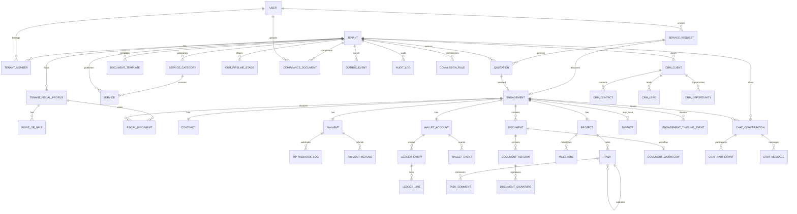

# FixYa — Modelo de Datos (Fase 3)

**Versión:** 1.0.0  
**Fecha:** 13 de junio de 2026  
**Depende de:** FASE-02-ARQUITECTURA-COMPLETA-FIXYA.md v1.0.0  

---

## 1. Resumen

Este documento consolida el **modelo de datos completo** de FixYa: ERD, schema Prisma, migraciones, índices, constraints, triggers, auditoría, soft delete, particionado y optimización.

### Artefactos generados

| Artefacto | Ubicación |
|-----------|-----------|
| Schema Prisma | `prisma/schema.prisma` |
| Extensiones y funciones | `prisma/sql/001_extensions_and_functions.sql` |
| Triggers | `prisma/sql/002_triggers.sql` |
| RLS policies | `prisma/sql/003_rls_policies.sql` |
| Views e índices | `prisma/sql/004_views_and_indexes.sql` |
| Variables entorno | `.env.example` |

### Estadísticas del modelo

| Métrica | Valor |
|---------|-------|
| Modelos Prisma | 52 |
| Enums | 35 |
| Tablas mapeadas | 52 |
| Relaciones | 80+ |
| Índices declarados (Prisma) | 90+ |
| Índices adicionales (SQL) | 15+ |
| Materialized views | 3 |
| Triggers | 20+ |
| Políticas RLS | 14 tablas |

---

## 2. ERD completo por dominio

### 2.1 Diagrama ERD global



### 2.2 Dominios y tablas

| Dominio | Tablas |
|---------|--------|
| **Identity** | tenants, users, tenant_members, refresh_tokens, user_sessions |
| **Fiscal config** | tenant_fiscal_profiles, points_of_sale |
| **Marketplace** | service_categories, services, service_requests, quotations, quotation_items, favorites, service_reviews |
| **Engagement** | engagements, engagement_timeline_events, disputes, contracts |
| **Documents** | documents, document_versions, document_templates, document_workflows, document_workflow_steps, document_signatures |
| **Payments** | payments, payment_refunds, mp_webhook_logs |
| **Wallet** | wallet_accounts, ledger_entries, ledger_lines, wallet_events, commission_rules |
| **Emitia/Fiscal** | fiscal_documents, fiscal_document_items, emitia_audit_logs |
| **Projects** | projects, tasks, task_comments, milestones |
| **CRM** | crm_pipeline_stages, crm_clients, crm_contacts, crm_leads, crm_opportunities, crm_activities |
| **Compliance** | compliance_documents |
| **Chat** | chat_conversations, chat_participants, chat_messages, chat_read_receipts |
| **Notifications** | notifications, notification_preferences |
| **Infrastructure** | audit_logs, outbox_events, idempotency_keys |

---

## 3. Convenciones de diseño

### 3.1 Naming

| Elemento | Convención | Ejemplo |
|----------|------------|---------|
| Tablas | snake_case plural | `wallet_accounts` |
| Columnas | snake_case | `tenant_id` |
| PK | UUID v4 | `@default(uuid())` |
| FK | `{entity}_id` | `engagement_id` |
| Timestamps | `created_at`, `updated_at` | TIMESTAMPTZ |
| Soft delete | `deleted_at` | NULL = activo |
| Montos | DECIMAL(18,2) | ARS |
| Moneda | VARCHAR(3) | `ARS` |

### 3.2 Soft delete

Tablas con `deleted_at`: tenants, users, tenant_members, services, service_requests, quotations, engagements, documents, projects, tasks, crm_*, compliance_documents, service_reviews, chat_messages.

**Regla:** Nunca DELETE físico en entidades de negocio. Queries default filtran `deleted_at IS NULL`.

### 3.3 Auditoría dual

1. **Triggers SQL** en tablas críticas → `audit_logs` (INSERT/UPDATE/DELETE).
2. **Application layer** enriquece con `user_id`, `ip`, `user_agent`.

### 3.4 Inmutabilidad wallet

- `ledger_entries` y `ledger_lines`: triggers bloquean UPDATE/DELETE.
- Correcciones via `LedgerEntryType.ADJUSTMENT` con referencia al original.

---

## 4. Constraints críticos

| Constraint | Tabla | Descripción |
|------------|-------|-------------|
| UNIQUE | payments.mp_payment_id | Idempotencia webhook MP |
| UNIQUE | mp_webhook_logs.idempotency_key | No reprocesar webhook |
| UNIQUE | engagements.service_request_id | 1 engagement por solicitud |
| UNIQUE | engagements.quotation_id | 1 engagement por cotización |
| UNIQUE | fiscal_documents (profile, pv, number, type) | No duplicar comprobante |
| UNIQUE | wallet_events (account, sequence) | Event sourcing ordenado |
| UNIQUE | tenant_members (tenant, user) | Una membresía por par |
| CHECK (app) | ledger_lines | SUM(debit) = SUM(credit) por entry |
| CHECK (app) | service_reviews.rating | 1-5 |

---

## 5. Índices estratégicos

### 5.1 Por patrón de acceso

| Patrón | Índice |
|--------|--------|
| Dashboard tenant engagements | `(tenant_id, status, created_at DESC)` |
| Historial cliente | `(client_id, status)` |
| Webhook MP lookup | `(mp_payment_id) UNIQUE` |
| Outbox polling | `(status, created_at) WHERE PENDING` |
| Libro diario | `(tenant_id, posted_at DESC)` |
| Geo marketplace | `(latitude, longitude)` + PostGIS futuro |
| Full-text búsqueda | GIN trgm en title/description |
| Compliance vencimientos | `(expires_at, status)` |
| Chat paginado | `(conversation_id, created_at DESC)` |

### 5.2 Partial indexes (activos)

```sql
WHERE deleted_at IS NULL
WHERE status = 'PENDING'
WHERE processed = false
```

---

## 6. Row Level Security

Todas las tablas tenant-scoped tienen RLS habilitado con política:

```sql
USING (fixya_is_super_admin() OR tenant_id = fixya_current_tenant_id())
```

**Middleware NestJS** por request:
```sql
SELECT set_config('app.current_tenant_id', $1, true);
SELECT set_config('app.current_user_id', $2, true);
SELECT set_config('app.is_super_admin', $3, true);
```

---

## 7. Triggers

| Trigger | Tabla | Propósito |
|---------|-------|-----------|
| `trg_*_updated_at` | 17 tablas | Auto-update updated_at |
| `trg_ledger_*_no_update` | ledger_* | Inmutabilidad contable |
| `trg_wallet_events_sequence` | wallet_events | Secuencia auto-increment |
| `trg_*_audit` | engagements, payments, wallet, fiscal, disputes | Audit log automático |

---

## 8. Materialized views (read models CQRS)

| View | Propósito | Refresh |
|------|-----------|---------|
| `mv_engagement_timeline` | Timeline expediente | On event insert / cron 5min |
| `mv_wallet_tenant_summary` | Dashboard contador | Cron hourly |
| `mv_crm_pipeline_summary` | Pipeline CRM | On opportunity change / cron 15min |

---

## 9. Particionado (plan escala)

| Tabla | Umbral | Estrategia |
|-------|--------|------------|
| audit_logs | 50M rows | RANGE mensual por created_at |
| ledger_entries | 50M rows | RANGE mensual por posted_at |
| chat_messages | 100M rows | HASH 8 partitions por conversation_id |
| mp_webhook_logs | 10M rows | RANGE semanal por created_at |

---

## 10. Plan de cuentas wallet (referencia)

| Código | Nombre | Tipo |
|--------|--------|------|
| 2110 | Fondos Retenidos | Activo |
| 2120 | Fondos Liberados | Activo |
| 2130 | Garantía Retenida | Activo |
| 4100 | Comisión FixYa | Ingreso |
| 4110 | Comisión Mercado Pago | Gasto |
| 1100 | Cuentas por Cobrar Cliente | Activo |
| 3100 | Pasivo Profesional | Pasivo |

---

## 11. Flujo de migraciones

```bash
# 1. Instalar dependencias
npm install

# 2. Configurar DATABASE_URL en .env

# 3. Generar migración inicial desde schema
npx prisma migrate dev --name init

# 4. Aplicar SQL post-migración (extensiones, triggers, RLS, views)
psql $DATABASE_URL -f prisma/sql/001_extensions_and_functions.sql
psql $DATABASE_URL -f prisma/sql/002_triggers.sql
psql $DATABASE_URL -f prisma/sql/003_rls_policies.sql
psql $DATABASE_URL -f prisma/sql/004_views_and_indexes.sql

# 5. Generar client
npx prisma generate
```

---

## 12. Plan de seeds (Fase 4)

Datos iniciales requeridos:
- Tenant PLATFORM (FixYa)
- Categorías globales de servicios (plomería, electricidad, etc.)
- Commission rules globales default (ej: 8%)
- Pipeline CRM default (5 etapas)
- SUPER_ADMIN user

---

## 13. Relación con Fase 4

El schema Prisma es la base directa para:
- Repositorios NestJS (Prisma adapters)
- DTOs y mappers domain ↔ persistence
- Tests de integración con Testcontainers PostgreSQL
- Seed data para desarrollo

---

**Fin del Modelo de Datos — Fase 3**

*Próximo paso: Fase 4 — Backend NestJS (módulos, CQRS, APIs REST, Swagger)*
